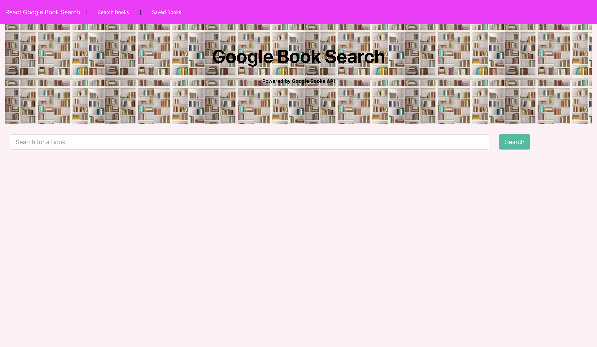

# Google-books-react-search

A react app that provides a list of books searched for by user. It uses React lifecycle methods to query and display books based on user searches.The app also has a Node backend, allowing users to save books to review or purchase later.

## Screenshots

